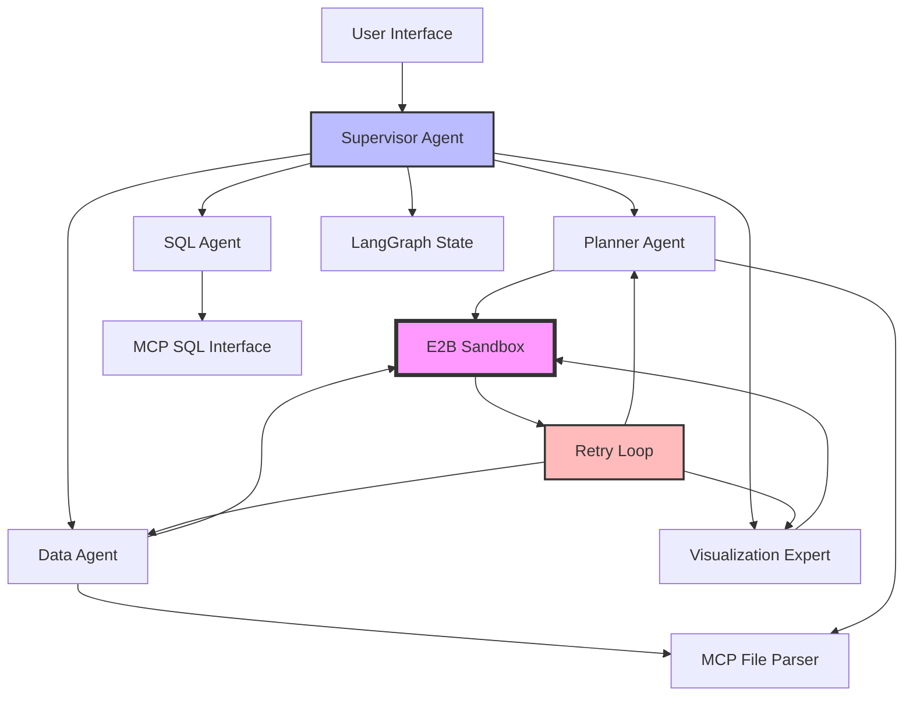
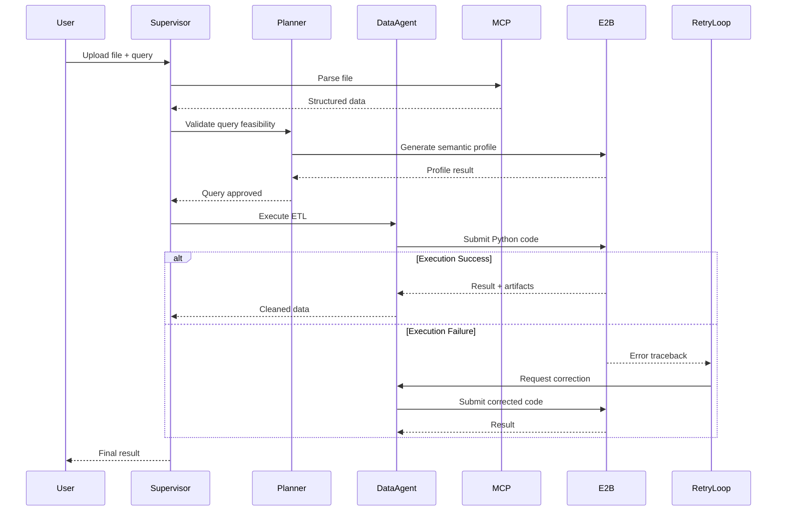
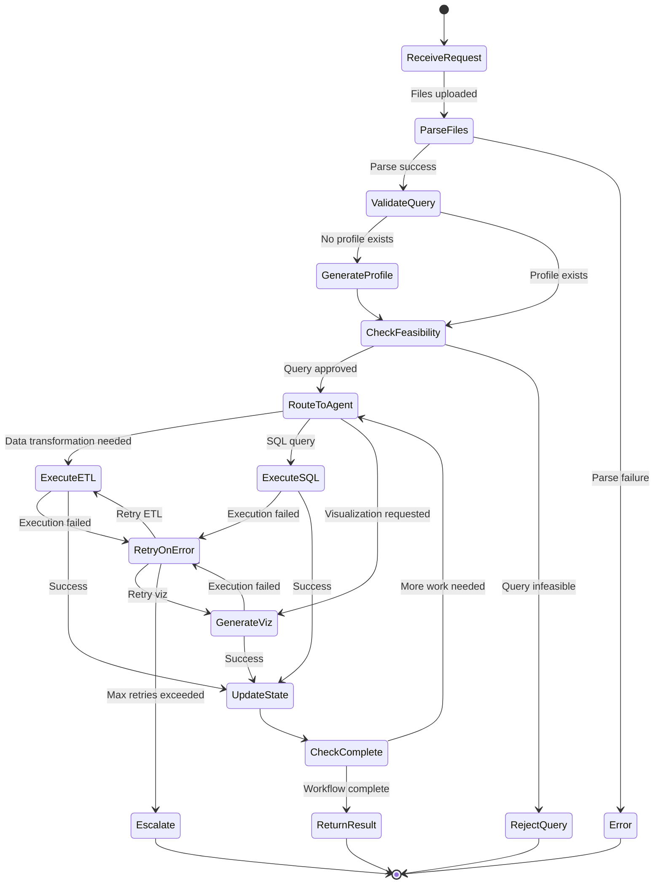

# Design Document: Autonomous Data-to-Insight Platform

## Overview

The Autonomous Data-to-Insight Platform is a supervised multi-agent system that transforms unstructured data into actionable insights through secure, isolated code execution. The architecture employs LangGraph for state orchestration, E2B sandboxes for secure Python execution, and the Model Context Protocol (MCP) for universal data ingestion.

The system follows a functional programming paradigm with immutable data processing, where all transformations operate on temporary working copies while preserving original data. A self-healing retry mechanism automatically recovers from execution failures by feeding error tracebacks back to the originating agents for code correction.

### Key Design Principles

1. **Security First**: All AI-generated code executes in isolated cloud sandboxes with no access to the host system
2. **Immutability**: Original data files remain unchanged; all transformations operate on in-memory copies
3. **Self-Healing**: Automatic error recovery through feedback loops between sandbox execution and agent code generation
4. **Separation of Concerns**: Clear boundaries between orchestration (Supervisor), validation (Planner), execution (E2B), and data access (MCP)
5. **Stateful Orchestration**: LangGraph manages persistent state across multi-step workflows

## Architecture

### System Components



### Architecture Layers

**Layer 1: User Interface**
- Accepts user queries and file uploads
- Displays results, visualizations, and error messages
- Maintains session context

**Layer 2: Orchestration (Supervisor Agent)**
- Routes requests to specialized sub-agents
- Manages LangGraph state transitions
- Coordinates multi-step workflows
- Aggregates results from sub-agents

**Layer 3: Specialized Agents**
- **Planner Agent**: Query feasibility validation using semantic profiling
- **Data Agent**: ETL operations and data transformation
- **Visualization Expert**: Chart generation using matplotlib/seaborn/plotly
- **SQL Agent**: Relational database query execution

**Layer 4: Execution & Data Access**
- **E2B Sandbox**: Isolated Python code execution environment
- **MCP File Parser**: Universal file format ingestion
- **MCP SQL Interface**: Database connection and query execution

**Layer 5: Error Recovery**
- **Retry Loop**: Captures execution failures and triggers code correction

### Data Flow



## Agent Code Generation and E2B Execution Flow

This section details how each agent generates Python code and executes it in the E2B sandbox. Understanding this flow is critical for implementation.

### Overview: Two-Phase Agent Pattern

All code-generating agents (Planner, Data, Visualization) follow a two-phase pattern:

**Phase 1: Code Generation (Host Process)**
- Agent uses LLM to generate Python code as a string
- Code is tailored to the specific task (profiling, ETL, visualization)
- Code includes necessary imports and data manipulation logic
- No execution happens in this phase

**Phase 2: Code Execution (E2B Sandbox)**
- Generated code string is sent to E2B sandbox
- E2B executes code in isolated environment with pandas, duckdb, matplotlib, etc.
- Results and artifacts are extracted from sandbox
- If execution fails, retry loop feeds error back to agent for correction

### Planner Agent: Semantic Profile Generation in E2B

**What the Planner Does:**
The Planner generates Python code to analyze a dataset and create a semantic profile (column types, statistics, sample values).

**Code Generation Flow:**

```python
class PlannerAgent:
    def __init__(self, llm_client, e2b_wrapper):
        self.llm = llm_client
        self.e2b = e2b_wrapper
    
    def generate_semantic_profile(self, data: pd.DataFrame) -> Dict[str, Any]:
        """Generate semantic profile by executing analysis code in E2B."""
        
        # Phase 1: Generate Python code using LLM
        prompt = f"""
        Generate Python code to analyze this dataset and create a semantic profile.
        The dataset has {len(data)} rows and columns: {list(data.columns)}
        
        The code should:
        1. Import pandas as pd
        2. Analyze column data types
        3. Calculate statistics (min, max, mean, median) for numeric columns
        4. Get sample values for categorical columns
        5. Calculate missing value percentages
        6. Return results as a dictionary
        
        The DataFrame is available as variable 'df'.
        """
        
        generated_code = self.llm.generate_code(prompt)
        
        # Example generated code:
        # ```python
        # import pandas as pd
        # import numpy as np
        # 
        # profile = {
        #     'columns': [],
        #     'row_count': len(df),
        #     'data_types': {},
        #     'sample_values': {},
        #     'statistics': {}
        # }
        # 
        # for col in df.columns:
        #     dtype = str(df[col].dtype)
        #     profile['data_types'][col] = dtype
        #     
        #     if df[col].dtype in ['int64', 'float64']:
        #         profile['statistics'][col] = {
        #             'min': float(df[col].min()),
        #             'max': float(df[col].max()),
        #             'mean': float(df[col].mean()),
        #             'median': float(df[col].median())
        #         }
        #     else:
        #         profile['sample_values'][col] = df[col].value_counts().head(5).to_dict()
        # 
        # result = profile
        # ```
        
        # Phase 2: Execute in E2B sandbox
        context = ExecutionContext(
            variables={'df': data},  # Pass DataFrame to sandbox
            return_variable='result'  # Extract 'result' variable after execution
        )
        
        execution_result = self.e2b.execute_code(generated_code, context)
        
        if execution_result.success:
            return execution_result.result  # The 'profile' dictionary
        else:
            # Trigger retry loop
            raise ExecutionError(execution_result.error)
```

**Key Points:**
- Planner doesn't execute code locally - it generates code as a string
- E2B receives the DataFrame through the ExecutionContext
- E2B runs the code and returns the 'result' variable
- If code fails (e.g., KeyError), retry loop asks Planner to fix it

### Data Agent: ETL Code Generation and Execution

**What the Data Agent Does:**
Generates Python code to perform ETL operations (type casting, imputation, cleaning) on a working copy of the data.

**Code Generation Flow:**

```python
class DataAgent:
    def __init__(self, llm_client, e2b_wrapper, retry_loop):
        self.llm = llm_client
        self.e2b = e2b_wrapper
        self.retry_loop = retry_loop
    
    def execute_etl(self, data: pd.DataFrame, requirements: ETLRequirements) -> ETLResult:
        """Execute ETL operations by generating and running code in E2B."""
        
        # Create immutable working copy
        working_copy = data.copy()
        
        # Phase 1: Generate ETL code using LLM
        prompt = f"""
        Generate Python code to perform ETL operations on a DataFrame.
        
        Dataset info:
        - Columns: {list(data.columns)}
        - Data types: {data.dtypes.to_dict()}
        - Missing values: {data.isnull().sum().to_dict()}
        
        Requirements:
        - Convert 'date' column to datetime
        - Impute missing values in 'age' with median
        - Remove duplicates
        
        The DataFrame is available as 'df'.
        Store the transformed DataFrame in 'transformed_df'.
        Store a list of operations applied in 'operations'.
        """
        
        generated_code = self.llm.generate_code(prompt)
        
        # Example generated code:
        # ```python
        # import pandas as pd
        # 
        # operations = []
        # 
        # # Convert date column
        # df['date'] = pd.to_datetime(df['date'])
        # operations.append('Converted date column to datetime')
        # 
        # # Impute missing values
        # median_age = df['age'].median()
        # df['age'].fillna(median_age, inplace=True)
        # operations.append(f'Imputed missing age values with median: {median_age}')
        # 
        # # Remove duplicates
        # original_rows = len(df)
        # df = df.drop_duplicates()
        # operations.append(f'Removed {original_rows - len(df)} duplicate rows')
        # 
        # transformed_df = df
        # ```
        
        # Phase 2: Execute with retry loop
        context = ExecutionContext(
            variables={'df': working_copy},
            return_variables=['transformed_df', 'operations']
        )
        
        execution_result = self.retry_loop.execute_with_retry(
            agent=self,
            initial_code=generated_code,
            context=context
        )
        
        if execution_result.success:
            return ETLResult(
                transformed_data=execution_result.result['transformed_df'],
                operations_applied=execution_result.result['operations'],
                rows_affected=len(execution_result.result['transformed_df']),
                execution_time=execution_result.execution_time
            )
        else:
            raise ETLError(execution_result.error)
    
    def correct_code(self, error_info: ErrorInfo, context: ExecutionContext) -> str:
        """Called by retry loop when execution fails."""
        
        prompt = f"""
        The following Python code failed with an error:
        
        Code:
        {error_info.failed_code}
        
        Error:
        {error_info.error_type}: {error_info.error_message}
        
        Traceback:
        {error_info.traceback}
        
        Fix the code to resolve this error.
        """
        
        corrected_code = self.llm.generate_code(prompt)
        return corrected_code
```

**Key Points:**
- Data Agent creates a working copy before any operations
- Generated code operates on 'df' variable passed through ExecutionContext
- Retry loop automatically handles failures by calling correct_code()
- Original data remains unchanged (immutability guarantee)

### Visualization Expert: Chart Generation in E2B

**What the Visualization Expert Does:**
Generates Python code to create charts using matplotlib/seaborn/plotly, executes in E2B, and extracts the chart artifact.

**Code Generation Flow:**

```python
class VisualizationExpert:
    def __init__(self, llm_client, e2b_wrapper, retry_loop):
        self.llm = llm_client
        self.e2b = e2b_wrapper
        self.retry_loop = retry_loop
    
    def execute_visualization(self, data: pd.DataFrame, viz_request: str) -> VisualizationResult:
        """Generate and execute visualization code in E2B."""
        
        # Phase 1: Generate visualization code using LLM
        prompt = f"""
        Generate Python code to create a visualization.
        
        Dataset info:
        - Columns: {list(data.columns)}
        - Request: {viz_request}
        
        Use matplotlib or seaborn to create the chart.
        The DataFrame is available as 'df'.
        Save the figure to 'chart.png' using plt.savefig().
        """
        
        generated_code = self.llm.generate_code(prompt)
        
        # Example generated code:
        # ```python
        # import pandas as pd
        # import matplotlib.pyplot as plt
        # import seaborn as sns
        # 
        # plt.figure(figsize=(10, 6))
        # sns.scatterplot(data=df, x='age', y='income', hue='category')
        # plt.title('Age vs Income by Category')
        # plt.xlabel('Age')
        # plt.ylabel('Income')
        # plt.savefig('chart.png', dpi=300, bbox_inches='tight')
        # plt.close()
        # 
        # chart_metadata = {
        #     'chart_type': 'scatter',
        #     'x_column': 'age',
        #     'y_column': 'income',
        #     'hue_column': 'category'
        # }
        # ```
        
        # Phase 2: Execute in E2B and extract chart
        context = ExecutionContext(
            variables={'df': data},
            return_variables=['chart_metadata'],
            extract_files=['chart.png']  # Tell E2B to extract this file
        )
        
        execution_result = self.retry_loop.execute_with_retry(
            agent=self,
            initial_code=generated_code,
            context=context
        )
        
        if execution_result.success:
            # E2B returns the file as base64-encoded string
            chart_data = execution_result.artifacts['chart.png']
            metadata = execution_result.result['chart_metadata']
            
            return VisualizationResult(
                chart_type=metadata['chart_type'],
                format='png',
                data=chart_data,  # base64 string
                metadata=metadata
            )
        else:
            raise VisualizationError(execution_result.error)
    
    def correct_code(self, error_info: ErrorInfo, context: ExecutionContext) -> str:
        """Called by retry loop when visualization code fails."""
        
        prompt = f"""
        The following visualization code failed:
        
        Code:
        {error_info.failed_code}
        
        Error:
        {error_info.error_type}: {error_info.error_message}
        
        Fix the code to resolve this error.
        Common issues:
        - Column names might be incorrect
        - Data types might need conversion
        - Missing values might need handling
        """
        
        corrected_code = self.llm.generate_code(prompt)
        return corrected_code
```

**Key Points:**
- Visualization code runs entirely in E2B sandbox
- Charts are saved as files in E2B's temporary filesystem
- E2B extracts files and returns them as base64-encoded strings
- Retry loop handles common errors (wrong column names, type mismatches)

### E2B Sandbox Wrapper: Execution Details

**How E2B Executes Code:**

```python
class E2BSandboxWrapper:
    def __init__(self, api_key: str):
        self.api_key = api_key
    
    def execute_code(self, code: str, context: ExecutionContext) -> ExecutionResult:
        """Execute Python code in isolated E2B sandbox."""
        
        from e2b_code_interpreter import CodeInterpreter
        
        try:
            # Create E2B sandbox instance
            with CodeInterpreter(api_key=self.api_key) as sandbox:
                
                # Step 1: Upload data to sandbox
                for var_name, var_value in context.variables.items():
                    if isinstance(var_value, pd.DataFrame):
                        # Serialize DataFrame to CSV, upload to sandbox
                        csv_data = var_value.to_csv(index=False)
                        sandbox.filesystem.write('/tmp/data.csv', csv_data)
                        
                        # Add code to load DataFrame in sandbox
                        load_code = f"{var_name} = pd.read_csv('/tmp/data.csv')"
                        sandbox.notebook.exec_cell(load_code)
                
                # Step 2: Execute the generated code
                execution = sandbox.notebook.exec_cell(code)
                
                # Step 3: Check for errors
                if execution.error:
                    return ExecutionResult(
                        success=False,
                        error=ErrorInfo(
                            error_type=execution.error.name,
                            error_message=execution.error.value,
                            traceback=execution.error.traceback,
                            failed_code=code,
                            context={}
                        )
                    )
                
                # Step 4: Extract return variables
                results = {}
                for var_name in context.return_variables:
                    # Get variable value from sandbox
                    get_var_code = f"import pickle; pickle.dumps({var_name})"
                    var_execution = sandbox.notebook.exec_cell(get_var_code)
                    
                    if not var_execution.error:
                        # Deserialize the variable
                        import pickle
                        results[var_name] = pickle.loads(var_execution.results[0].data)
                
                # Step 5: Extract files (charts, CSVs, etc.)
                artifacts = {}
                for file_path in context.extract_files:
                    file_content = sandbox.filesystem.read(file_path)
                    # Base64 encode for transport
                    import base64
                    artifacts[file_path] = base64.b64encode(file_content).decode('utf-8')
                
                return ExecutionResult(
                    success=True,
                    result=results,
                    artifacts=artifacts,
                    error=None
                )
                
        except Exception as e:
            # Infrastructure error (E2B unavailable, network issue)
            return ExecutionResult(
                success=False,
                error=ErrorInfo(
                    error_type='InfrastructureError',
                    error_message=str(e),
                    traceback='',
                    failed_code=code,
                    context={}
                )
            )
```

**Key Points:**
- E2B creates a fresh Python environment for each execution
- DataFrames are serialized to CSV, uploaded, then loaded in sandbox
- Code executes in sandbox with access to pandas, numpy, matplotlib, etc.
- Results are extracted using pickle serialization
- Files (charts) are extracted and base64-encoded
- Errors include full traceback for debugging

### Retry Loop: Self-Healing Mechanism

**How Retry Loop Integrates with Agents:**

```python
class RetryLoop:
    def __init__(self, max_retries: int = 3):
        self.max_retries = max_retries
    
    def execute_with_retry(
        self, 
        agent: Agent,
        initial_code: str,
        context: ExecutionContext
    ) -> ExecutionResult:
        """Execute code with automatic retry on failure."""
        
        attempt = 0
        code = initial_code
        
        while attempt < self.max_retries:
            # Execute in E2B
            result = agent.e2b.execute_code(code, context)
            
            if result.success:
                return result
            
            # Execution failed - ask agent to fix it
            print(f"Attempt {attempt + 1} failed: {result.error.error_message}")
            
            # Agent generates corrected code
            code = agent.correct_code(result.error, context)
            attempt += 1
        
        # All retries exhausted
        return ExecutionResult(
            success=False,
            error=ErrorInfo(
                error_type='RetryExhausted',
                error_message=f'Failed after {self.max_retries} attempts',
                traceback='',
                failed_code=code,
                context={'attempts': attempt}
            )
        )
```

**Key Points:**
- Retry loop wraps E2B execution
- On failure, it calls agent's correct_code() method
- Agent uses LLM to generate fixed code based on error traceback
- Process repeats up to max_retries times
- If all retries fail, error escalates to Supervisor

### Complete Flow Example: ETL Request

Here's how a complete ETL request flows through the system:

```
1. User uploads CSV file with query: "Clean the data and fix missing values"

2. Supervisor receives request
   - Routes to MCP File Parser
   - MCP parses CSV → DataFrame

3. Supervisor routes to Planner Agent
   - Planner generates semantic profile code (Python string)
   - E2B executes profile code with DataFrame
   - Returns profile: {columns: [...], data_types: {...}, statistics: {...}}

4. Supervisor routes to Data Agent
   - Data Agent generates ETL code (Python string):
     ```python
     df['age'].fillna(df['age'].median(), inplace=True)
     df['date'] = pd.to_datetime(df['date'])
     transformed_df = df
     operations = ['Imputed age', 'Converted date']
     ```
   
   - Retry Loop executes code in E2B:
     - Attempt 1: Fails with KeyError: 'date' column doesn't exist
     - Retry Loop calls Data Agent.correct_code(error_info)
     - Data Agent generates fixed code (removes date conversion)
     - Attempt 2: Success!
   
   - E2B returns transformed DataFrame and operations list

5. Supervisor updates state with cleaned data

6. Supervisor returns result to user
```

### Summary: Agent Responsibilities

| Agent | Generates Code For | Executes In | Returns |
|-------|-------------------|-------------|---------|
| Planner | Semantic profiling, statistics | E2B | Profile dictionary |
| Data Agent | ETL operations, transformations | E2B | Transformed DataFrame |
| Visualization Expert | Chart creation (matplotlib/seaborn/plotly) | E2B | Chart file (base64) |
| SQL Agent | N/A (uses MCP directly) | MCP SQL | Query results |

**Critical Design Decision:**
- Agents are "code generators" not "code executors"
- All execution happens in E2B for security isolation
- Retry loop provides self-healing by feeding errors back to agents
- LLMs generate code, E2B runs it, retry loop fixes it

## Components and Interfaces

### Supervisor Agent

**Responsibility**: Orchestrate task routing and maintain system state

**State Schema** (LangGraph):
```python
class PlatformState(TypedDict):
    user_query: str
    uploaded_files: List[FileMetadata]
    semantic_profile: Optional[Dict[str, Any]]
    query_approved: bool
    working_data: Optional[pd.DataFrame]
    current_agent: str
    execution_history: List[ExecutionRecord]
    final_result: Optional[Any]
    error_state: Optional[ErrorInfo]
```

**Interface**:
```python
class SupervisorAgent:
    def route_request(self, state: PlatformState) -> str:
        """Determine which sub-agent should handle the current task.
        
        Returns: Agent name ('planner', 'data', 'visualization', 'sql')
        """
        
    def update_state(self, state: PlatformState, result: AgentResult) -> PlatformState:
        """Update state with sub-agent result."""
        
    def is_complete(self, state: PlatformState) -> bool:
        """Check if workflow is complete."""
```

**Routing Logic**:
1. If no semantic profile exists → route to Planner
2. If query not approved → route to Planner
3. If query contains SQL keywords and database connected → route to SQL Agent
4. If query requests visualization → route to Visualization Expert
5. If data needs transformation → route to Data Agent
6. Otherwise → return result to user

### Planner Agent

**Responsibility**: Validate query feasibility before execution

**Interface**:
```python
class PlannerAgent:
    def generate_semantic_profile(
        self, 
        data: pd.DataFrame
    ) -> Dict[str, Any]:
        """Generate semantic profile of dataset capabilities.
        
        Returns:
        {
            'columns': List[ColumnInfo],
            'row_count': int,
            'data_types': Dict[str, str],
            'sample_values': Dict[str, List[Any]],
            'statistics': Dict[str, Dict[str, float]]
        }
        """
        
    def validate_query(
        self, 
        query: str, 
        profile: Dict[str, Any]
    ) -> ValidationResult:
        """Validate if query is feasible given dataset capabilities.
        
        Returns: ValidationResult(approved=bool, reason=str)
        """
```

**Semantic Profile Generation**:
- Column names and inferred semantic types
- Statistical summaries (min, max, mean, median for numeric columns)
- Sample values for categorical columns
- Missing value percentages
- Detected relationships between columns

**Validation Logic**:
- Check if requested columns exist in dataset
- Verify operations are compatible with data types
- Detect impossible aggregations or joins
- Identify missing required data for requested analysis

### Data Agent

**Responsibility**: Automated ETL operations with immutable data processing

**Interface**:
```python
class DataAgent:
    def generate_etl_code(
        self, 
        data_profile: Dict[str, Any],
        requirements: ETLRequirements
    ) -> str:
        """Generate Python code for ETL operations.
        
        Returns: Python code string for execution in E2B
        """
        
    def create_working_copy(self, original_data: pd.DataFrame) -> pd.DataFrame:
        """Create in-memory copy for transformations."""
        
    def execute_etl(
        self, 
        code: str, 
        working_copy: pd.DataFrame
    ) -> ETLResult:
        """Execute ETL code in E2B sandbox."""
```

**ETL Operations**:
- Type enforcement and casting
- Missing value imputation (mean, median, mode, forward-fill)
- Outlier detection and handling
- Column renaming and standardization
- Duplicate removal
- Date/time parsing and normalization

**Immutability Guarantee**:
```python
# Original data is never modified
original_df = load_data(file_path)  # Stored in MCP context

# All operations on working copy
working_df = original_df.copy()
working_df = apply_transformations(working_df)

# Original remains unchanged
assert original_df.equals(load_data(file_path))
```

### Visualization Expert

**Responsibility**: Generate charts and visualizations

**Interface**:
```python
class VisualizationExpert:
    def generate_viz_code(
        self, 
        data_profile: Dict[str, Any],
        viz_request: str
    ) -> str:
        """Generate Python visualization code.
        
        Supports: matplotlib, seaborn, plotly
        Returns: Python code string
        """
        
    def execute_visualization(
        self, 
        code: str, 
        data: pd.DataFrame
    ) -> VisualizationResult:
        """Execute visualization code in E2B and extract chart."""
```

**Supported Chart Types**:
- Line plots, scatter plots, bar charts, histograms
- Heatmaps, correlation matrices
- Box plots, violin plots
- Time series plots
- Interactive plotly dashboards

**Output Format**:
- Static images: PNG/SVG base64-encoded
- Interactive charts: Plotly JSON specification
- Metadata: Chart type, dimensions, data ranges

### SQL Agent

**Responsibility**: Execute SQL queries against relational databases

**Interface**:
```python
class SQLAgent:
    def execute_query(
        self, 
        query: str, 
        connection: DatabaseConnection
    ) -> QueryResult:
        """Execute SQL query through MCP SQL interface.
        
        Returns: QueryResult(data=pd.DataFrame, metadata=QueryMetadata)
        """
        
    def validate_sql(self, query: str) -> ValidationResult:
        """Validate SQL syntax before execution."""
```

**Supported Operations**:
- SELECT with WHERE, JOIN, GROUP BY, HAVING, ORDER BY
- Aggregation functions (COUNT, SUM, AVG, MIN, MAX)
- Subqueries and CTEs
- Window functions

**Safety Constraints**:
- Read-only access (no INSERT, UPDATE, DELETE, DROP)
- Query timeout limits
- Result set size limits
- Connection pooling

### E2B Sandbox Wrapper

**Responsibility**: Isolated Python code execution with retry logic

**Interface**:
```python
class E2BSandboxWrapper:
    def execute_code(
        self, 
        code: str, 
        context: ExecutionContext
    ) -> ExecutionResult:
        """Execute Python code in isolated E2B sandbox.
        
        Args:
            code: Python code string
            context: Data and variables available to code
            
        Returns: ExecutionResult(
            success=bool,
            result=Any,
            artifacts=Dict[str, Any],
            error=Optional[ErrorInfo]
        )
        """
        
    def get_available_libraries(self) -> List[str]:
        """Return list of available Python libraries."""
```

**Execution Environment**:
- Python 3.11+
- Pre-installed libraries: pandas, numpy, duckdb, matplotlib, seaborn, plotly, scikit-learn
- Isolated filesystem with temporary storage
- Network access disabled by default
- Memory limit: 4GB per execution
- Timeout: 60 seconds per execution

**Artifact Extraction**:
- Generated files (CSV, images, HTML)
- Matplotlib figures
- Plotly JSON specifications
- Intermediate data structures

### Retry Loop

**Responsibility**: Self-healing error recovery

**Interface**:
```python
class RetryLoop:
    def __init__(self, max_retries: int = 3):
        self.max_retries = max_retries
        
    def execute_with_retry(
        self, 
        agent: Agent,
        initial_code: str,
        context: ExecutionContext
    ) -> ExecutionResult:
        """Execute code with automatic retry on failure.
        
        Flow:
        1. Submit code to E2B
        2. If error, extract traceback
        3. Feed traceback to agent for correction
        4. Retry with corrected code
        5. Repeat up to max_retries
        6. Escalate to Supervisor if all retries fail
        """
```

**Retry Strategy**:
```python
attempt = 0
code = initial_code

while attempt < max_retries:
    result = e2b_sandbox.execute_code(code, context)
    
    if result.success:
        return result
    
    # Extract error information
    error_info = ErrorInfo(
        traceback=result.error.traceback,
        error_type=result.error.type,
        error_message=result.error.message,
        failed_code=code
    )
    
    # Request correction from agent
    code = agent.correct_code(error_info, context)
    attempt += 1

# All retries exhausted
return ExecutionResult(
    success=False,
    error=ErrorInfo(message="Max retries exceeded")
)
```

### MCP Integration

**File Parser Interface**:
```python
class MCPFileParser:
    def detect_format(self, file_path: str) -> str:
        """Detect file format using heuristics.
        
        Supported: CSV, JSON, Excel, Parquet, XML, HTML tables
        """
        
    def parse_file(self, file_path: str) -> pd.DataFrame:
        """Parse file into structured DataFrame."""
        
    def get_parse_options(self, format: str) -> Dict[str, Any]:
        """Return format-specific parsing options."""
```

**SQL Interface**:
```python
class MCPSQLInterface:
    def connect(self, connection_string: str) -> DatabaseConnection:
        """Establish database connection."""
        
    def execute_query(
        self, 
        connection: DatabaseConnection,
        query: str
    ) -> pd.DataFrame:
        """Execute SQL query and return results."""
        
    def get_schema(self, connection: DatabaseConnection) -> Dict[str, TableSchema]:
        """Retrieve database schema information."""
```

## Data Models

### Core Data Structures

**FileMetadata**:
```python
@dataclass
class FileMetadata:
    file_id: str
    filename: str
    format: str
    size_bytes: int
    upload_timestamp: datetime
    parsed: bool
    parse_error: Optional[str]
```

**ExecutionRecord**:
```python
@dataclass
class ExecutionRecord:
    execution_id: str
    agent_name: str
    code: str
    timestamp: datetime
    success: bool
    result: Optional[Any]
    error: Optional[ErrorInfo]
    retry_count: int
```

**ErrorInfo**:
```python
@dataclass
class ErrorInfo:
    error_type: str
    error_message: str
    traceback: str
    failed_code: str
    context: Dict[str, Any]
```

**ValidationResult**:
```python
@dataclass
class ValidationResult:
    approved: bool
    reason: str
    suggestions: List[str]
```

**ETLResult**:
```python
@dataclass
class ETLResult:
    transformed_data: pd.DataFrame
    operations_applied: List[str]
    rows_affected: int
    execution_time: float
```

**VisualizationResult**:
```python
@dataclass
class VisualizationResult:
    chart_type: str
    format: str  # 'png', 'svg', 'plotly_json'
    data: str  # base64 or JSON
    metadata: Dict[str, Any]
```

### LangGraph State Transitions




## Correctness Properties

*A property is a characteristic or behavior that should hold true across all valid executions of a system—essentially, a formal statement about what the system should do. Properties serve as the bridge between human-readable specifications and machine-verifiable correctness guarantees.*

### Property Reflection

After analyzing all acceptance criteria, I identified several redundancies:

- **3.2 and 3.4**: Both test that original data remains unchanged during transformations. These can be combined into a single comprehensive immutability property.
- **5.3 and 10.2**: Both test that state is updated when agents complete tasks. These are identical and should be consolidated.
- **Multiple retry loop properties (2.1-2.5)**: These describe a sequential flow that can be tested as a single comprehensive retry behavior property.
- **Agent execution location properties (7.3, 8.2)**: These all test that code executes in E2B, which can be combined into one property about execution isolation.

The following properties represent the unique, non-redundant validation requirements:

### Property 1: Successful Execution Returns Results and Artifacts

*For any* valid Python code that executes successfully in the E2B sandbox, the execution result should contain both a result value and any generated artifacts (files, figures, data structures).

**Validates: Requirements 1.2**

### Property 2: Failed Execution Captures Complete Traceback

*For any* Python code that raises an exception during E2B execution, the returned error information should contain a complete traceback including error type, message, and stack trace.

**Validates: Requirements 1.3**

### Property 3: Retry Loop Bounded Execution

*For any* sequence of code execution failures, the retry loop should attempt correction at most N times (where N is the configured max_retries), and upon exceeding this limit, should escalate to the Supervisor without further retry attempts.

**Validates: Requirements 2.4, 2.5**

### Property 4: Retry Loop Error Feedback

*For any* execution error returned by E2B, the retry loop should feed the complete error information (traceback, error type, message, failed code) to the originating agent and request corrected code before re-execution.

**Validates: Requirements 2.1, 2.2, 2.3**

### Property 5: Data Immutability Through Transformations

*For any* data transformation operation performed by the Data Agent, the original source data should remain byte-for-byte identical before and after the operation, with all changes applied only to the working copy.

**Validates: Requirements 3.1, 3.2, 3.3, 3.4**

### Property 6: File Format Detection Accuracy

*For any* uploaded file with a recognizable format signature (CSV, JSON, Excel, Parquet, XML), the MCP file parser should correctly identify the format type.

**Validates: Requirements 4.3**

### Property 7: Successful Parsing Produces Structured Data

*For any* file of a supported format that passes format detection, the MCP parser should produce a structured DataFrame representation without raising exceptions.

**Validates: Requirements 4.4**

### Property 8: Parse Failures Return Descriptive Errors

*For any* file that cannot be parsed (corrupted, unsupported format, malformed content), the MCP parser should return an error result containing a descriptive message explaining the failure reason.

**Validates: Requirements 4.5**

### Property 9: Supervisor Routes to Exactly One Agent

*For any* user request received by the Supervisor, the routing decision should select exactly one sub-agent (Planner, Data, Visualization, or SQL) to handle the task, never zero and never multiple.

**Validates: Requirements 5.4**

### Property 10: State Updates on Agent Completion

*For any* sub-agent task completion, the Supervisor should update the LangGraph state to reflect the agent's result, execution status, and any produced artifacts.

**Validates: Requirements 5.3, 10.2**

### Property 11: Workflow Completion Returns Result

*For any* workflow where all required sub-tasks have completed successfully, the Supervisor should return a final result to the user and transition to a terminal state.

**Validates: Requirements 5.5**

### Property 12: Semantic Profile Generation Completeness

*For any* dataset provided to the Planner, the generated semantic profile should include column information, data types, row count, sample values, and statistical summaries for all columns.

**Validates: Requirements 6.1**

### Property 13: Query Validation Precedes Code Generation

*For any* user query, the Planner's validation decision (approve or reject) should be recorded in state before any code generation agent (Data, Visualization, SQL) is invoked.

**Validates: Requirements 6.5**

### Property 14: Infeasible Query Rejection with Explanation

*For any* query that the Planner determines to be infeasible (requesting non-existent columns, incompatible operations, or impossible aggregations), the validation result should contain approval=False and a non-empty explanation string.

**Validates: Requirements 6.3**

### Property 15: Feasible Query Approval

*For any* query that the Planner determines to be feasible (all requested columns exist, operations are compatible with data types), the validation result should contain approval=True.

**Validates: Requirements 6.4**

### Property 16: ETL Code Generation for Type Enforcement

*For any* raw dataset with columns requiring type casting (strings that should be dates, numbers stored as text), the Data Agent should generate Python code that includes explicit type conversion operations.

**Validates: Requirements 7.1**

### Property 17: ETL Code Generation for Missing Value Imputation

*For any* dataset containing missing values (NaN, None, empty strings), the Data Agent should generate Python code that includes imputation logic (mean, median, mode, or forward-fill).

**Validates: Requirements 7.2**

### Property 18: Agent Code Execution Isolation

*For any* code generated by Data Agent or Visualization Expert, the execution should occur within the E2B sandbox environment, not in the host process.

**Validates: Requirements 7.3, 8.2**

### Property 19: Successful ETL Returns Cleaned Data

*For any* ETL operation that completes without errors, the Data Agent should return an ETLResult containing a transformed DataFrame and a list of operations applied.

**Validates: Requirements 7.4**

### Property 20: Failed Operations Trigger Retry

*For any* code execution failure in Data Agent or Visualization Expert, the retry loop should be invoked before returning an error to the Supervisor.

**Validates: Requirements 7.5, 8.4**

### Property 21: Visualization Code Uses Approved Libraries

*For any* visualization request, the generated Python code should import and use at least one of the approved libraries (matplotlib, seaborn, plotly).

**Validates: Requirements 8.1**

### Property 22: Successful Visualization Extracts Chart

*For any* visualization code that executes successfully, the Visualization Expert should extract a chart artifact from the E2B execution state in a displayable format (PNG, SVG, or Plotly JSON).

**Validates: Requirements 8.3**

### Property 23: Visualization Output Format Validity

*For any* chart returned by the Visualization Expert, the format field should be one of the supported types ('png', 'svg', 'plotly_json') and the data field should be non-empty.

**Validates: Requirements 8.5**

### Property 24: SQL Queries Route Through MCP

*For any* SQL query request received by the SQL Agent, the query execution should be delegated to the MCP SQL interface rather than executed directly.

**Validates: Requirements 9.1**

### Property 25: Successful SQL Query Returns Result Set

*For any* SQL query that executes without errors, the SQL Agent should return a QueryResult containing a DataFrame with the query results and metadata about the execution.

**Validates: Requirements 9.3**

### Property 26: Failed SQL Query Returns Error Message

*For any* SQL query that fails (syntax error, table not found, permission denied), the SQL Agent should return an error result containing a descriptive message explaining the failure.

**Validates: Requirements 9.4**

### Property 27: Context Provision on Agent Request

*For any* agent that requests context information from the Supervisor, the provided state should include all relevant fields needed for the agent's operation (uploaded files, semantic profile, working data).

**Validates: Requirements 10.3**

### Property 28: State Persistence Across Session Interactions

*For any* sequence of user interactions within a single session, state information (uploaded files, semantic profiles, execution history) should be accessible to all subsequent interactions until session termination.

**Validates: Requirements 10.4**

### Property 29: Session Cleanup on Termination

*For any* session that ends (user logout, timeout, explicit termination), the Supervisor should clean up temporary resources including working copies, E2B sandbox instances, and transient state data.

**Validates: Requirements 10.5**

## Error Handling

### Error Categories

**1. Parse Errors (MCP Layer)**
- Invalid file format
- Corrupted file content
- Unsupported encoding
- Missing required fields

**Handling**: Return descriptive error to user immediately, do not proceed to validation

**2. Validation Errors (Planner Layer)**
- Query requests non-existent columns
- Operations incompatible with data types
- Insufficient data for requested analysis

**Handling**: Reject query with explanation and suggestions, do not generate code

**3. Execution Errors (E2B Layer)**
- Python syntax errors in generated code
- Runtime exceptions (KeyError, ValueError, etc.)
- Memory limit exceeded
- Timeout exceeded

**Handling**: Invoke retry loop for automatic correction (up to max_retries)

**4. Retry Exhaustion Errors**
- All retry attempts failed
- Agent unable to generate valid correction

**Handling**: Escalate to Supervisor, return error to user with execution history

**5. Infrastructure Errors**
- E2B sandbox unavailable
- MCP connection failure
- Database connection timeout

**Handling**: Return infrastructure error to user, suggest retry

### Error Recovery Strategies

**Automatic Recovery (Retry Loop)**:
```python
class ErrorRecoveryStrategy:
    def handle_execution_error(
        self, 
        error: ErrorInfo,
        agent: Agent,
        context: ExecutionContext
    ) -> RecoveryAction:
        """Determine recovery strategy based on error type."""
        
        if error.error_type in ['SyntaxError', 'NameError', 'AttributeError']:
            # Code generation error - agent can likely fix
            return RecoveryAction.RETRY_WITH_CORRECTION
            
        elif error.error_type in ['MemoryError', 'TimeoutError']:
            # Resource constraint - may need different approach
            return RecoveryAction.RETRY_WITH_OPTIMIZATION
            
        elif error.error_type in ['KeyError', 'ValueError']:
            # Data issue - agent needs more context
            return RecoveryAction.RETRY_WITH_ADDITIONAL_CONTEXT
            
        else:
            # Unknown error - escalate
            return RecoveryAction.ESCALATE
```

**Manual Intervention Required**:
- Infrastructure failures (E2B unavailable, database down)
- Persistent validation failures (query fundamentally infeasible)
- Security violations (attempted file system access, network requests)

### Error Context Preservation

All errors maintain full context for debugging:
```python
@dataclass
class ErrorContext:
    error_info: ErrorInfo
    execution_history: List[ExecutionRecord]
    state_snapshot: PlatformState
    agent_name: str
    retry_count: int
    timestamp: datetime
```

This context is:
- Logged for system monitoring
- Returned to user for transparency
- Used by retry loop for correction
- Stored in execution history for audit

## Testing Strategy

### Dual Testing Approach

The system requires both unit testing and property-based testing for comprehensive coverage:

**Unit Tests**: Focus on specific examples, edge cases, and integration points
- Example: Test that CSV parser correctly handles a specific malformed file
- Example: Test that Supervisor routes a specific SQL query to SQL Agent
- Edge case: Test empty DataFrame handling
- Edge case: Test maximum retry limit boundary (exactly N retries)

**Property-Based Tests**: Verify universal properties across randomized inputs
- Property: For any valid DataFrame, immutability is preserved through transformations
- Property: For any execution error, retry loop provides error context to agent
- Property: For any query, exactly one agent is selected for routing

### Property-Based Testing Configuration

**Framework Selection**: 
- Python: Use `hypothesis` library for property-based testing
- Minimum 100 iterations per property test (due to randomization)
- Each test must reference its design document property

**Test Tagging Format**:
```python
@given(dataframe=dataframes(), transformation=sampled_from(TRANSFORMATIONS))
def test_data_immutability(dataframe, transformation):
    """
    Feature: autonomous-data-insight-platform
    Property 5: For any data transformation operation performed by the 
    Data Agent, the original source data should remain byte-for-byte 
    identical before and after the operation.
    """
    original_copy = dataframe.copy()
    data_agent.execute_transformation(dataframe, transformation)
    assert dataframe.equals(original_copy)
```

### Test Coverage by Component

**Supervisor Agent**:
- Unit: Test routing logic for each agent type
- Unit: Test state update for specific agent results
- Property: Verify exactly-one-agent routing for all requests
- Property: Verify state persistence across interaction sequences

**Planner Agent**:
- Unit: Test semantic profile generation for sample datasets
- Unit: Test specific infeasible queries (non-existent columns)
- Property: Verify profile completeness for all datasets
- Property: Verify validation precedes code generation

**Data Agent**:
- Unit: Test specific ETL operations (date parsing, imputation)
- Unit: Test working copy creation
- Property: Verify immutability for all transformations
- Property: Verify ETL code generation for datasets with missing values

**Visualization Expert**:
- Unit: Test specific chart types (line plot, bar chart)
- Unit: Test artifact extraction
- Property: Verify approved library usage for all viz requests
- Property: Verify output format validity for all charts

**SQL Agent**:
- Unit: Test specific SQL queries (SELECT, JOIN)
- Unit: Test error handling for invalid queries
- Property: Verify MCP routing for all queries
- Property: Verify result set return for successful queries

**E2B Sandbox Wrapper**:
- Unit: Test specific library availability (pandas, duckdb)
- Unit: Test timeout handling
- Property: Verify result and artifact return for successful executions
- Property: Verify traceback capture for all exceptions

**Retry Loop**:
- Unit: Test max retry boundary (exactly N attempts)
- Unit: Test escalation on exhaustion
- Property: Verify bounded execution for all failure sequences
- Property: Verify error feedback for all execution errors

**MCP Integration**:
- Unit: Test specific file formats (CSV, JSON, Excel)
- Unit: Test database connection
- Property: Verify format detection accuracy for recognizable files
- Property: Verify structured data output for supported formats
- Property: Verify descriptive errors for unparseable files

### Integration Testing

**End-to-End Workflows**:
1. File upload → Parse → Validate → ETL → Return cleaned data
2. File upload → Parse → Validate → Visualization → Return chart
3. Database connect → SQL query → Return results
4. File upload → Parse → Validation failure → Reject with explanation
5. File upload → Parse → Validate → ETL failure → Retry → Success
6. File upload → Parse → Validate → ETL failure → Retry exhaustion → Escalate

**State Transition Testing**:
- Verify all LangGraph state transitions occur correctly
- Test state persistence across multi-step workflows
- Test session cleanup on termination

### Performance Testing

**Benchmarks**:
- E2B execution time for typical ETL operations (< 10 seconds)
- Semantic profile generation time (< 5 seconds for datasets up to 1M rows)
- Retry loop overhead (< 2 seconds per retry)
- End-to-end workflow completion (< 30 seconds for typical queries)

**Load Testing**:
- Concurrent user sessions (target: 100 simultaneous sessions)
- Large file handling (up to 100MB CSV files)
- Complex visualizations (datasets with 10K+ points)

### Security Testing

**Sandbox Isolation**:
- Verify generated code cannot access host filesystem
- Verify network access is disabled
- Verify memory limits are enforced
- Verify timeout limits are enforced

**SQL Injection Prevention**:
- Test parameterized query handling
- Verify read-only database access
- Test query timeout enforcement

**Data Privacy**:
- Verify original files are not logged
- Verify sensitive data is not included in error messages
- Test session isolation (users cannot access each other's data)

